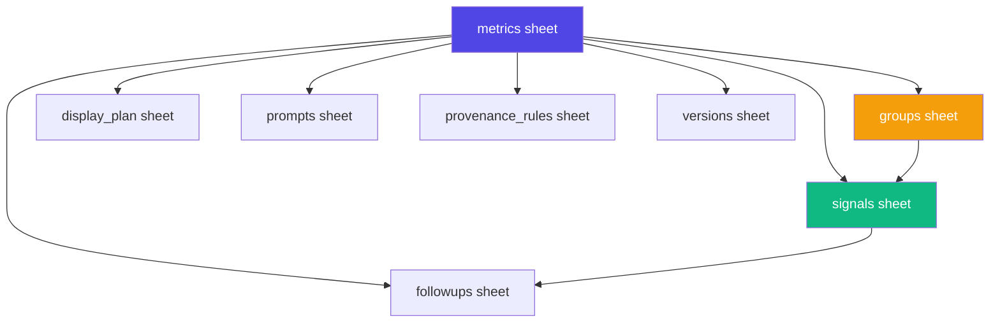

# Metadata & UI Integration Analysis
**Date:** 2025-11-06
**Purpose:** Analyze Excel metadata structure and propose dynamic integration architecture

---

## Executive Summary

The HealthLevers application currently uses **hardcoded TypeScript/JSON configurations** for specialty metadata, signals, and prompts. The **USNWR_Master_AllMetrics_v4.xlsx** file contains a comprehensive, structured metadata system with **8 interconnected sheets** that define metrics, signals, groups, followups, prompts, and display configuration.

**Key Findings:**
- ✅ Excel metadata is well-structured and comprehensive (54 metrics, 542 signals, 301 followups)
- ⚠️ Current codebase is ~80% hardcoded with limited dynamic configuration
- 🎯 Significant opportunity to make the application fully metadata-driven
- 📊 No mock UI screens exist - the current UI is the reference implementation

---

## 1. Current State Analysis

### Current Metadata Sources

#### A. Client-Side Hardcoded Data
**File:** `client/src/data/specialtyMetadata.ts` (264 lines)
- Defines 5 specialties with 35 total modules
- Hardcoded module names, descriptions, default prompts, display orders
- Structure:
  ```typescript
  {
    specialty: "Orthopedics",
    modules: [
      {
        name: "Timeliness – SCH",
        value: "timeliness_sch",
        description: "Was surgery ≤19h from ED arrival?",
        defaultPrompt: "Analyze the timeline...",
        displayOrder: 1,
        groups: ["Core", "Delay Drivers", "Documentation", "Ruleouts"]
      }
    ]
  }
  ```

**File:** `client/src/data/orthoSignalMatrix.ts` (525 lines)
- Defines 483+ hardcoded signal definitions
- Each signal has: id, label, definition, group, module, followups
- Example:
  ```typescript
  {
    id: "dx_confirmed_sch",
    label: "Dx Confirmed",
    definition: "SCH fracture diagnosis confirmed in operative report",
    group: "Core",
    module: "Timeliness – SCH",
    followups: ["Does the operative report confirm diagnosis?"]
  }
  ```

#### B. Server-Side Hardcoded Data
**File:** `server/data/specialties.json` (201 lines)
- Contains 12 questions for orthopedics + 2 cardiology + 2 neurology
- Each question has:
  - `key_fields`: Data fields required for validation
  - `signal_chips`: Available signal options
  - `signal_defs`: Signal definitions with rules
  - `validation`: Validation expressions

#### C. Current Data Flow
```
User Action → Hardcoded TS/JSON Files → React Components → UI Rendering
                    ↓
              No dynamic loading
              No central metadata source
              No version control
```

### Current UI Implementation

**Pages:**
1. **Intake Page** (`client/src/pages/intake.tsx`)
   - Specialty selector (hardcoded from specialtyMetadata.ts)
   - Module selector (hardcoded from specialtyMetadata.ts)
   - JSON patient data input
   - Signal chip display (from orthoSignalMatrix.ts)
   - AI processing integration

2. **Planning Page** (`client/src/pages/planning.tsx`)
   - Domain/module configuration
   - Group visibility toggles
   - Field ordering controls
   - Saves config to localStorage

3. **Home Page** (Review interface)
   - Case list view
   - Signal status display
   - Evidence drawer
   - Inline review panels

**UI Components:**
- ChipButton for signal display
- EvidenceDrawer for showing signal evidence
- PromptPlay for prompt management
- Progressive disclosure design pattern

---

## 2. Excel Metadata Structure Analysis

### Sheet 1: `metrics` (54 rows, 11 columns)
**Purpose:** Master definition of all quality metrics

| Column | Example Value | Description |
|--------|--------------|-------------|
| specialty | Ortho | Specialty identifier |
| specialty_id | ORTHO | Normalized ID |
| question_code | I25 | USNWR question code |
| metric_name | In OR <18 hrs – Supracondylar fracture | Display name |
| priority | 1 | Priority level |
| threshold_hours | 18.0 | Time threshold for metric |
| definition_window | start_time -> end_time | Time window definition |
| active | True | Is metric currently active |
| version | 0.0.1 | Metric version |
| domain | timeliness | Domain category |
| metric_id | ORTHO_I25 | Unique identifier |

**Coverage:**
- Orthopedics: 31 metrics (I25, I26, I32a/b, I33-I40, etc.)
- Behavioral Health: 23 metrics (L27-series)

### Sheet 2: `groups` (223 rows, 5 columns)
**Purpose:** Signal grouping and categorization

| Column | Example | Description |
|--------|---------|-------------|
| metric_id | ORTHO_I25 | Links to metrics sheet |
| group_id | core | Group identifier |
| group_name | Core | Display name |
| display_order | 1 | Rendering order |
| group_code | Core | Normalized code |

**Standard Groups:**
1. **Core** - Essential signals (display_order: 1)
2. **Delay Drivers** - Factors causing delays (display_order: 2)
3. **Documentation** - Documentation issues (display_order: 3)
4. **Ruleouts** - Exclusion criteria (display_order: 4)
5. **Overrides** - Clinical overrides (display_order: 5)

### Sheet 3: `signals` (542 rows, 5 columns)
**Purpose:** Individual signal definitions with trigger logic

| Column | Example | Description |
|--------|---------|-------------|
| metric_id | ORTHO_I25 | Links to metrics |
| signal_code | within_threshold | Signal identifier |
| group_id | core | Links to groups |
| trigger_expr | end_time - start_time < threshold | Validation logic |
| severity | info/warn/error | Signal severity level |

**Coverage:** 542 total signals across 54 metrics (~10 signals per metric average)

**Signal Types:**
- **info**: Informational signals (e.g., "within_threshold")
- **warn**: Warning signals (e.g., "borderline_pm30")
- **error**: Critical issues (e.g., "missing_start", "conflicting_times")

### Sheet 4: `followups` (301 rows, 5 columns)
**Purpose:** Dynamic follow-up questions for abstractors

| Column | Example | Description |
|--------|---------|-------------|
| metric_id | ORTHO_I25 | Links to metrics |
| followup_id | FU_CT | Unique followup ID |
| when_cond | imaging_delay OR extra_imaging | Conditional trigger |
| question_text | Was CT clinically required beyond X-ray? | Question for abstractor |
| response_type | single-select / text / timestamp+text | Input type |

**Response Types:**
- `single-select`: Dropdown/radio options
- `text`: Free-form text entry
- `timestamp+text`: Combined timestamp + notes

### Sheet 5: `display_plan` (323 rows, 6 columns)
**Purpose:** UI field visibility and layout configuration

| Column | Example | Description |
|--------|---------|-------------|
| metric_id | BEHAVIORALHEALTH_L27 | Links to metrics |
| display_tier | primary/secondary | Visibility tier |
| field_name | medication_list | Data field name |
| order_in_tier | 1, 2, 3... | Display sequence |
| visibility_cond | NaN (optional) | Conditional visibility |
| field_label | medication_list | UI label |

**Display Tiers:**
- **primary**: Always visible, top priority fields
- **secondary**: Shown on expand/detail view

### Sheet 6: `prompts` (108 rows, 7 columns)
**Purpose:** AI prompts for different workflow stages

| Column | Example | Description |
|--------|---------|-------------|
| metric_id | ORTHO_I25 | Links to metrics |
| prompt_type | intake / abstractor | Workflow stage |
| prompt_text | SYSTEM: You compute USNWR Ortho I25... | Full prompt text |
| prompt_version | 2.0, 2.3 | Version number |
| prompt_role | system | OpenAI role |
| prompt_notes | NaN | Optional notes |
| last_changed_at | 2025-09-07T16:49:27 | Last update timestamp |

**Prompt Types:**
- **intake**: Initial case processing
- **abstractor**: Human review assistance

### Sheet 7: `provenance_rules` (108 rows, 6 columns)
**Purpose:** Data lineage and validation requirements

| Column | Example | Description |
|--------|---------|-------------|
| metric_id | ORTHO_I25 | Links to metrics |
| field_name | start_time | Data field |
| source_table | ehr_table | Source system |
| key_field | patient_id | Linking field |
| require_author | True | Author required? |
| require_taken_instant | True | Timestamp required? |

### Sheet 8: `versions` (54 rows, 6 columns)
**Purpose:** Version tracking and change management

| Column | Example | Description |
|--------|---------|-------------|
| metric_id | ORTHO_I25 | Links to metrics |
| bundle_version | v0.1 | Overall bundle version |
| schema_version | v0.1 | Data schema version |
| prompts_version | v1.0 | Prompts version |
| notes | NaN | Version notes |
| content_version | v4 | Content version |

---

## 3. Gap Analysis

### Current vs. Excel Comparison

| Feature | Current Implementation | Excel Metadata | Gap |
|---------|----------------------|----------------|-----|
| **Metrics Definition** | Hardcoded in specialtyMetadata.ts | Structured in `metrics` sheet (54 rows) | 🔴 Complete rebuild needed |
| **Signal Definitions** | Hardcoded in orthoSignalMatrix.ts | Structured in `signals` sheet (542 rows) | 🔴 Complete rebuild needed |
| **Signal Grouping** | Partial (groups array in metadata) | Comprehensive in `groups` sheet (223 rows) | 🟡 Enhancement needed |
| **Follow-up Questions** | Hardcoded in signal definitions | Dynamic in `followups` sheet (301 rows) | 🔴 New feature |
| **Display Configuration** | Partial (planning.tsx) | Complete in `display_plan` sheet (323 rows) | 🟡 Enhancement needed |
| **AI Prompts** | PromptStore (localStorage) | Versioned in `prompts` sheet (108 rows) | 🟡 Merge needed |
| **Provenance Tracking** | Not implemented | Defined in `provenance_rules` sheet | 🔴 New feature |
| **Version Management** | Not implemented | Tracked in `versions` sheet | 🔴 New feature |
| **Trigger Expressions** | Not implemented | Defined in `signals.trigger_expr` | 🔴 New feature |
| **Conditional Followups** | Not implemented | Defined in `followups.when_cond` | 🔴 New feature |

### Key Missing Features

1. **Dynamic Metric Loading**
   - Current: Hardcoded TypeScript imports
   - Needed: Runtime loading from metadata source

2. **Expression Evaluation Engine**
   - Current: None
   - Needed: Evaluate `trigger_expr` and `when_cond` expressions

3. **Conditional UI Rendering**
   - Current: Basic show/hide
   - Needed: Expression-based visibility control

4. **Version Control System**
   - Current: None
   - Needed: Track and manage metadata versions

5. **Data Provenance Tracking**
   - Current: None
   - Needed: Track data lineage per provenance_rules

6. **Dynamic Follow-up System**
   - Current: Hardcoded followup text
   - Needed: Conditional followup questions based on signal state

---

## 4. Integration Architecture Proposal

### A. Metadata Backend Service

```
┌─────────────────────────────────────────────────┐
│         Metadata Backend Service                │
├─────────────────────────────────────────────────┤
│  Excel Parser (Python/Node.js)                  │
│    ├─ Read USNWR_Master_AllMetrics_v4.xlsx     │
│    ├─ Validate sheet structure                  │
│    └─ Generate JSON API payload                 │
│                                                  │
│  REST API Endpoints                             │
│    ├─ GET /api/metadata/metrics                 │
│    ├─ GET /api/metadata/signals/:metric_id      │
│    ├─ GET /api/metadata/groups/:metric_id       │
│    ├─ GET /api/metadata/followups/:metric_id    │
│    ├─ GET /api/metadata/prompts/:metric_id      │
│    ├─ GET /api/metadata/display/:metric_id      │
│    └─ GET /api/metadata/versions                │
│                                                  │
│  Caching Layer (Redis or in-memory)            │
│    └─ Cache parsed metadata for 24h             │
└─────────────────────────────────────────────────┘
```

### B. Frontend Metadata Consumption

```typescript
// New: Dynamic Metadata Loader
import { useQuery } from '@tanstack/react-query';

export function useMetadata() {
  const { data: metrics } = useQuery({
    queryKey: ['metadata', 'metrics'],
    queryFn: () => fetch('/api/metadata/metrics').then(r => r.json()),
    staleTime: 1000 * 60 * 60 // 1 hour
  });

  const getSignalsForMetric = (metricId: string) => {
    return useQuery({
      queryKey: ['metadata', 'signals', metricId],
      queryFn: () => fetch(`/api/metadata/signals/${metricId}`).then(r => r.json())
    });
  };

  return { metrics, getSignalsForMetric };
}
```

### C. Expression Evaluation Engine

```typescript
// New: Expression Evaluator
import { parse } from 'expr-eval';

export class ExpressionEvaluator {
  evaluate(expr: string, context: Record<string, any>): boolean {
    try {
      const parser = parse(expr);
      return parser.evaluate(context);
    } catch (error) {
      console.error('Expression evaluation failed:', expr, error);
      return false;
    }
  }

  // Examples:
  // evaluate("end_time - start_time < threshold", { end_time: 20, start_time: 2, threshold: 19 })
  // evaluate("imaging_delay OR extra_imaging", { imaging_delay: true, extra_imaging: false })
}
```

### D. Updated Data Flow

```
┌──────────────────────────────────────────────────────────────┐
│                     User Action                              │
└────────────────────┬─────────────────────────────────────────┘
                     │
                     ▼
┌──────────────────────────────────────────────────────────────┐
│           Frontend React Components                          │
│  ┌─────────────────────────────────────────────────────┐    │
│  │  useMetadata() Hook → React Query                   │    │
│  └───────────────────┬─────────────────────────────────┘    │
└────────────────────┬─┘                                       │
                     │                                         │
                     ▼                                         │
┌──────────────────────────────────────────────────────────────┐
│              Metadata API Service                            │
│  ┌─────────────────────────────────────────────────────┐    │
│  │  GET /api/metadata/* endpoints                      │    │
│  │  ├─ Check cache (Redis/Memory)                      │    │
│  │  ├─ Parse Excel if not cached                       │    │
│  │  └─ Return JSON response                            │    │
│  └─────────────────────────────────────────────────────┘    │
└────────────────────┬─────────────────────────────────────────┘
                     │
                     ▼
┌──────────────────────────────────────────────────────────────┐
│         USNWR_Master_AllMetrics_v4.xlsx                      │
│  8 sheets: metrics, groups, signals, followups, etc.        │
└──────────────────────────────────────────────────────────────┘
```

### E. Dynamic UI Rendering Architecture

```typescript
// Dynamic Intake Page
export function DynamicIntakePage() {
  const { metrics } = useMetadata();
  const [selectedMetric, setSelectedMetric] = useState<string | null>(null);
  const { data: signals } = useSignalsForMetric(selectedMetric);
  const { data: groups } = useGroupsForMetric(selectedMetric);
  const { data: display } = useDisplayPlanForMetric(selectedMetric);

  // Render specialty selector from metadata
  const specialties = useMemo(() =>
    [...new Set(metrics?.map(m => m.specialty))],
    [metrics]
  );

  // Render modules dynamically
  const modules = useMemo(() =>
    metrics?.filter(m => m.specialty === selectedSpecialty),
    [metrics, selectedSpecialty]
  );

  // Render signal chips by group
  const signalsByGroup = useMemo(() => {
    if (!signals || !groups) return {};
    return groups.reduce((acc, group) => {
      acc[group.group_name] = signals.filter(s => s.group_id === group.group_id);
      return acc;
    }, {});
  }, [signals, groups]);

  return (
    <div>
      {/* Specialty Selector */}
      <select>
        {specialties.map(s => <option key={s}>{s}</option>)}
      </select>

      {/* Module Selector */}
      <div>
        {modules?.map(m => (
          <ChipButton key={m.metric_id} onClick={() => setSelectedMetric(m.metric_id)}>
            {m.metric_name}
          </ChipButton>
        ))}
      </div>

      {/* Signal Groups */}
      {Object.entries(signalsByGroup).map(([groupName, groupSignals]) => (
        <SignalGroup
          key={groupName}
          name={groupName}
          signals={groupSignals}
        />
      ))}
    </div>
  );
}
```

---

## 5. Implementation Roadmap

### Phase 1: Foundation (Week 1-2)
**Goal:** Set up metadata backend service

**Tasks:**
1. ✅ Create Excel parser service
   - Use `pandas` (Python) or `xlsx` (Node.js)
   - Parse all 8 sheets into JSON
   - Validate relationships between sheets

2. ✅ Create REST API endpoints
   - `/api/metadata/metrics` - List all metrics
   - `/api/metadata/signals/:metric_id` - Get signals for metric
   - `/api/metadata/groups/:metric_id` - Get groups for metric
   - `/api/metadata/followups/:metric_id` - Get followups for metric
   - `/api/metadata/prompts/:metric_id` - Get prompts for metric
   - `/api/metadata/display/:metric_id` - Get display config for metric
   - `/api/metadata/versions` - Get version info

3. ✅ Add caching layer
   - In-memory cache with 24h TTL
   - Cache invalidation on Excel file update

4. ✅ Update server entry point
   - Mount metadata routes
   - Add Excel file watcher for hot-reload

**Deliverables:**
- Functional metadata API service
- Postman/Thunder collection for testing
- API documentation

### Phase 2: Frontend Integration (Week 3-4)
**Goal:** Replace hardcoded data with dynamic metadata loading

**Tasks:**
1. ✅ Create metadata hooks
   - `useMetadata()` - Fetch and cache metadata
   - `useMetricDefinition(metricId)` - Get specific metric
   - `useSignalsForMetric(metricId)` - Get signals
   - `useGroupsForMetric(metricId)` - Get groups

2. ✅ Update Intake Page
   - Replace `specialtyMetadata.ts` imports with `useMetadata()`
   - Dynamically render specialty selector
   - Dynamically render module chips
   - Dynamically render signal groups

3. ✅ Update Planning Page
   - Load display configuration from API
   - Maintain localStorage for user preferences
   - Merge API config with user overrides

4. ✅ Update Review/Home Page
   - Use dynamic signal definitions
   - Render evidence based on display_plan

**Deliverables:**
- Fully dynamic Intake, Planning, and Home pages
- Deprecate hardcoded `specialtyMetadata.ts` and `orthoSignalMatrix.ts`
- Migration guide for existing localStorage data

### Phase 3: Expression Engine (Week 5-6)
**Goal:** Implement trigger and condition evaluation

**Tasks:**
1. ✅ Create expression evaluator
   - Parse `trigger_expr` from signals sheet
   - Parse `when_cond` from followups sheet
   - Support operators: `<`, `>`, `<=`, `>=`, `==`, `!=`, `AND`, `OR`, `is null`

2. ✅ Integrate with signal validation
   - Evaluate `trigger_expr` during signal processing
   - Set signal severity based on evaluation result
   - Log evaluation results for debugging

3. ✅ Implement conditional followups
   - Evaluate `when_cond` for each followup
   - Only show followups when condition is true
   - Support different `response_type` inputs

**Deliverables:**
- Working expression evaluation engine
- Dynamic signal validation
- Conditional followup UI

### Phase 4: Advanced Features (Week 7-8)
**Goal:** Add provenance tracking and version management

**Tasks:**
1. ✅ Implement data provenance
   - Track source_table and key_field per provenance_rules
   - Require author and timestamp when specified
   - Display provenance info in Evidence Drawer

2. ✅ Add version management
   - Display current version from versions sheet
   - Track prompt versions used for each case
   - Support version comparison (future)

3. ✅ Add admin UI for metadata
   - View current metadata configuration
   - Upload new Excel file
   - Preview changes before activation
   - Rollback to previous version

**Deliverables:**
- Data provenance tracking system
- Version management UI
- Admin panel for metadata management

### Phase 5: Testing & Migration (Week 9-10)
**Goal:** Comprehensive testing and production migration

**Tasks:**
1. ✅ Unit tests for expression evaluator
2. ✅ Integration tests for metadata API
3. ✅ E2E tests for dynamic UI
4. ✅ Performance testing (load time, cache hit rate)
5. ✅ Migration script for existing data
6. ✅ User documentation
7. ✅ Training materials for abstractors

**Deliverables:**
- Test coverage > 80%
- Migration checklist
- User guide
- Production deployment plan

---

## 6. Technical Considerations

### A. Performance Optimization

**Problem:** Loading 542 signals + 301 followups on every page load could be slow.

**Solutions:**
1. **Lazy Loading**: Only load signals when metric is selected
2. **Aggressive Caching**: Cache parsed Excel data for 24h
3. **Code Splitting**: Load metadata hooks only when needed
4. **Pagination**: Limit initial load to 20 metrics, load more on scroll

### B. Backward Compatibility

**Problem:** Existing cases in localStorage use hardcoded signal IDs.

**Solutions:**
1. **Migration Script**: Map old signal IDs to new metric_id + signal_code
2. **Dual Mode**: Support both legacy and dynamic modes during transition
3. **Deprecation Warnings**: Warn users to re-process old cases

### C. Error Handling

**Problem:** Excel parsing errors, missing sheets, or invalid expressions.

**Solutions:**
1. **Validation Layer**: Validate Excel structure before parsing
2. **Fallback Mode**: Use cached version if parsing fails
3. **Error Reporting**: Send parsing errors to monitoring service
4. **User Feedback**: Show clear error messages in UI

### D. Security Considerations

**Problem:** Expression evaluation could be exploited for code injection.

**Solutions:**
1. **Sandboxed Evaluation**: Use safe expression parser (no `eval()`)
2. **Input Validation**: Validate all expressions before evaluation
3. **Whitelist Operators**: Only allow safe operators
4. **Rate Limiting**: Limit API requests to prevent DoS

---

## 7. UI/UX Recommendations

### A. Dynamic Module Selection

**Current:**
```typescript
// Hardcoded chips
<ChipButton>Timeliness – SCH</ChipButton>
<ChipButton>SSI Assessment</ChipButton>
```

**Proposed:**
```typescript
// Dynamic chips from metadata
{metrics?.filter(m => m.specialty === selectedSpecialty).map(m => (
  <ChipButton
    key={m.metric_id}
    variant={selectedMetric === m.metric_id ? 'primary' : 'secondary'}
    badge={m.active ? null : 'Inactive'}
  >
    {m.metric_name}
    {m.threshold_hours && (
      <span className="text-xs ml-2">≤{m.threshold_hours}h</span>
    )}
  </ChipButton>
))}
```

### B. Grouped Signal Display

**Current:**
```typescript
// Flat list of signals
{signals.map(s => <SignalChip>{s.label}</SignalChip>)}
```

**Proposed:**
```typescript
// Grouped by category with collapsible sections
{groups?.map(group => (
  <Collapsible key={group.group_id} defaultOpen={group.display_order <= 2}>
    <CollapsibleTrigger>
      {group.group_name} ({signalsByGroup[group.group_id]?.length})
    </CollapsibleTrigger>
    <CollapsibleContent>
      {signalsByGroup[group.group_id]?.map(signal => (
        <SignalChip
          key={signal.signal_code}
          severity={signal.severity}
          triggerExpr={signal.trigger_expr}
        >
          {signal.signal_code}
        </SignalChip>
      ))}
    </CollapsibleContent>
  </Collapsible>
))}
```

### C. Conditional Follow-up Questions

**Proposed:**
```typescript
// Show followups only when condition is met
{followups
  ?.filter(f => evaluateCondition(f.when_cond, signalState))
  .map(f => (
    <FollowupQuestion
      key={f.followup_id}
      question={f.question_text}
      responseType={f.response_type}
      onResponse={(value) => recordFollowupResponse(f.followup_id, value)}
    />
  ))
}
```

### D. Display Tier Visibility

**Proposed:**
```typescript
// Show fields based on display_plan tiers
<DataFields tier="primary" metricId={selectedMetric} caseData={patientData} />

<Button onClick={() => setShowSecondary(!showSecondary)}>
  {showSecondary ? 'Hide' : 'Show'} Additional Fields
</Button>

{showSecondary && (
  <DataFields tier="secondary" metricId={selectedMetric} caseData={patientData} />
)}
```

---

## 8. Data Examples

### Example: Fetching Signals for ORTHO_I25

**Request:**
```http
GET /api/metadata/signals/ORTHO_I25
```

**Response:**
```json
{
  "metric_id": "ORTHO_I25",
  "signals": [
    {
      "signal_code": "within_threshold",
      "group_id": "core",
      "group_name": "Core",
      "trigger_expr": "end_time - start_time < threshold",
      "severity": "info",
      "display_order": 1
    },
    {
      "signal_code": "borderline_pm30",
      "group_id": "core",
      "group_name": "Core",
      "trigger_expr": "abs(end_time - start_time - threshold) <= 0.5",
      "severity": "warn",
      "display_order": 2
    },
    {
      "signal_code": "missing_start",
      "group_id": "documentation",
      "group_name": "Documentation",
      "trigger_expr": "start_time is null",
      "severity": "error",
      "display_order": 3
    }
  ],
  "groups": [
    {"group_id": "core", "group_name": "Core", "display_order": 1},
    {"group_id": "delay_drivers", "group_name": "Delay Drivers", "display_order": 2},
    {"group_id": "documentation", "group_name": "Documentation", "display_order": 3}
  ],
  "version": "v4"
}
```

### Example: Evaluating Trigger Expression

**Context:**
```json
{
  "start_time": 1.5,
  "end_time": 18.2,
  "threshold": 18.0
}
```

**Expression:** `end_time - start_time < threshold`
**Evaluation:** `18.2 - 1.5 = 16.7 < 18.0` → **TRUE** ✅
**Result:** Signal "within_threshold" should be **active**

---

## 9. Next Steps

### Immediate Actions (This Week)
1. ✅ Review this analysis document with stakeholders
2. ✅ Prioritize phases based on business value
3. ✅ Set up development environment for Excel parsing
4. ✅ Create proof-of-concept API endpoint for one metric
5. ✅ Test frontend integration with mock metadata API

### Decision Points
- **Hosting:** Where to host the metadata API? (Same Express server vs separate microservice)
- **Database:** Store parsed metadata in PostgreSQL or keep as file-based?
- **Updates:** How often will the Excel file be updated? (Daily/Weekly/Monthly)
- **Versioning:** Do we need to support multiple active versions simultaneously?
- **Migration:** Big bang cutover or gradual feature flag rollout?

### Success Metrics
- **Performance:** < 200ms API response time for metadata endpoints
- **Adoption:** 100% of new metrics use dynamic metadata (no hardcoding)
- **Maintenance:** Reduce metadata update time from 2 hours to 15 minutes
- **Scalability:** Support 100+ metrics without performance degradation
- **Reliability:** 99.9% uptime for metadata service

---

## 10. Appendix

### A. Excel Sheet Relationships



### B. Current Hardcoded Files to Replace

| File | Lines | Replacement Source | Priority |
|------|-------|-------------------|----------|
| `client/src/data/specialtyMetadata.ts` | 264 | `metrics` sheet | 🔴 High |
| `client/src/data/orthoSignalMatrix.ts` | 525 | `signals` + `groups` sheets | 🔴 High |
| `server/data/specialties.json` | 201 | Multiple sheets | 🟡 Medium |
| `client/src/data/moduleIdMapping.ts` | 58 | `metrics.metric_id` | 🟢 Low |

### C. Technology Stack Recommendations

**Backend:**
- **Excel Parsing:** `pandas` (Python) or `xlsx` (Node.js)
- **API Framework:** Express.js (already in use)
- **Caching:** `node-cache` or Redis
- **Validation:** Zod (already in use)

**Frontend:**
- **Data Fetching:** React Query (already in use)
- **Expression Parsing:** `expr-eval` or `jexl`
- **State Management:** React Context + React Query
- **UI Components:** shadcn/ui (already in use)

---

## Conclusion

The **USNWR_Master_AllMetrics_v4.xlsx** file provides a comprehensive, well-structured metadata foundation that far exceeds the current hardcoded implementation. By implementing the proposed dynamic metadata architecture, the HealthLevers application will gain:

1. ✅ **Flexibility:** Add new metrics without code changes
2. ✅ **Maintainability:** Centralized metadata management
3. ✅ **Scalability:** Support 100+ metrics easily
4. ✅ **Version Control:** Track changes and support rollbacks
5. ✅ **Consistency:** Single source of truth for all metadata
6. ✅ **Auditability:** Track data provenance and lineage

The implementation roadmap spans 10 weeks with clear phases, deliverables, and success metrics. The architecture leverages existing technology (React Query, Express, Zod) while adding new capabilities (expression evaluation, dynamic UI rendering).

**Recommended Approach:** Start with Phase 1 (Foundation) to prove the concept, then proceed with frontend integration based on early feedback.

---

**Document Version:** 1.0
**Author:** Claude AI
**Last Updated:** 2025-11-06
